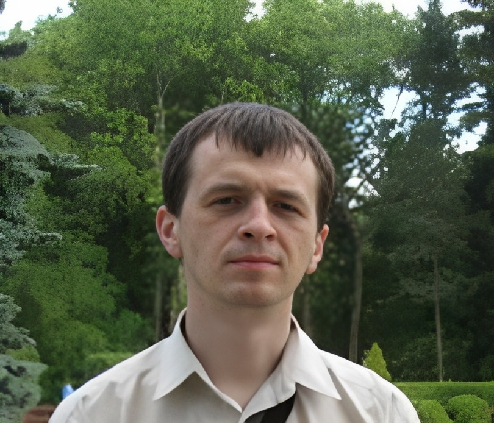

# Andrei Punko - Newcomer introduction

Hello

Some time ago I graduated from Belarusian State University with Physicist-Researcher specialization.

Before arriving to a current project, I worked on:
- BSUIR as a scientist / researcher who performed modeling of physical processes
- Linline as an electronics engineer who participated in construction and tuning of electronics for cosmetology lasers
- BMC as an electronics engineer and software developer who worked on prototyping of a device for diesel fuels testing
- Epam Systems / Godel Technologies / Artezio / iTechArt / Bell Integrator as a software engineer
  who used Java stack mostly on different projects related to next domains:
  Travel / Finance / Documentation / Blockchain / Entertainment

My hobbies in early years were reading, electronic device construction, programming and wood carving,
but during last years I mostly prefer just programming.

From time to time I publish videos with a solution of some tasks
using Java language on my YouTube channel [Java coding interview](https://www.youtube.com/@andd3dfx)

What about books: I prefer technical literature (related to my specialization) and philosophical books
(written by Eastern Orthodox fathers).
To refresh consumed knowledge, I keep track of [book list](https://github.com/andrei-punko/books) I have read

What about programming:
- used Basic in childhood / early years (before 1998),
- used Pascal / C for modeling in university (1998-2011),
- used C for microcontrollers programming (2008-2011),
- use Java as the main language during last time (2011-now),
- for some projects faced a bit with Groovy / Lua / Python / Go / Kotlin languages
- probably will switch from Java to Kotlin mostly in future to write less code

To stay healthy, I usually use walks / swimming.
To track progress / statistics, I use Garmin watches.
[Profile](https://connect.garmin.com/modern/profile/754a6849-312d-4bcc-bda2-631f5ebe0477) in Garmin cloud shared for public access 

Glad to meet you!
