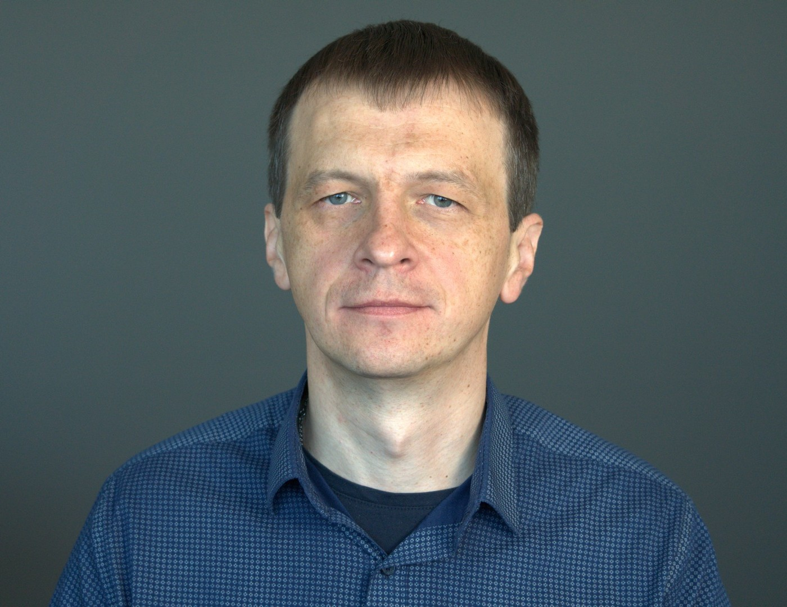

# Andrei Punko - Newcomer introduction

Hello

Some time ago I graduated from Belarusian State University with Physicist-Researcher specialization.

Before arriving to a current project, I worked on:

- BSUIR as a scientist / researcher who performed modeling of physical processes
- Linline as an electronics engineer who participated in construction and tuning of electronics for cosmetology lasers
- BMC as an electronics engineer and software developer who worked on prototyping of a device for diesel fuels testing
- As a software engineer for next companies:
  - Epam Systems
  - Godel Technologies
  - Artezio
  - iTechArt
  - Bell Integrator

  and used Java stack mostly on different projects related to next domains:
    - FinTech
    - Entertainment
    - Blockchain
    - Documentation
    - Travelling

My hobbies in early years were reading, electronic device construction, programming and wood carving,
but during last years I mostly prefer reading, programming, swimming.

What about books:
- I prefer technical literature (related to my specialization) and
- Philosophical books (written by Eastern Orthodox fathers).

To organize consumed knowledge, I keep track of [book list](https://github.com/andrei-punko/books) I have read

What about programming:
- used Basic in childhood / early years (before 1998),
- used Pascal / C for modeling in university (1998-2011),
- used C for microcontrollers programming (2008-2011),
- use Java as the main language during last time (2011-now),
- for some projects faced a bit with Groovy / Lua / Python / Go / Kotlin languages
- probably will switch from Java to Kotlin mostly in future to write less code

To stay healthy, I usually use walks / swimming.

Glad to meet you!
