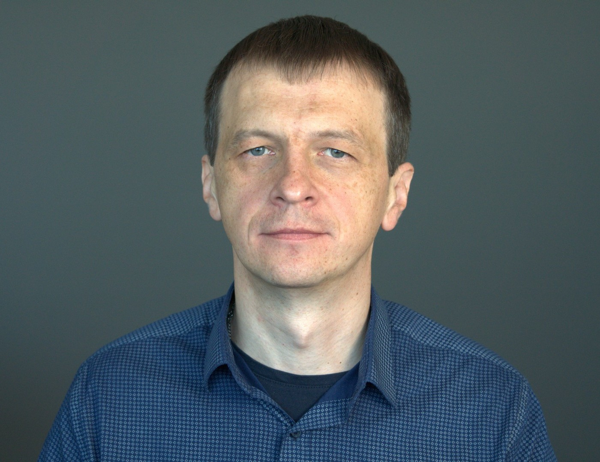

# Андрей Пунько - Представление сотрудника

Добрый день

В свое время я закончил физический факультет Белгосуниверситета по специальности "Физик-исследователь".

До прихода сюда работал:

- научным сотрудником в БГУИР, где моделировал физические процессы в металлах и полупроводниках
- инженером в Linline, где участвовал в изготовлении и настройке электроники для косметологических лазеров
- инженером-программистом в БМЦ, где участвовал в разработке и изготовлении устройств для измерения качества
  нефтепродуктов
- инженером-программистом в
  - Epam Systems
  - Godel Technologies
  - Artezio
  - iTechArt
  - Bell Integrator,

  где в основном использовал Java-стек на различных проектах связанных с такими доменами как:
    - ФинТех
    - Развлечения
    - Блокчейн
    - Документооборот
    - Путешествия

В юности моими увлечениями были: чтение, радиоэлектроника, программирование и резьба по дереву,
но в последние годы в основном предпочитаю чтение, программирование, плавание.

Что касается книг:
- читаю техническую литературу (связанную с моей специализацией) и
- духовные книги (написанные отцами
Восточной Церкви)

Веду [список](https://github.com/andrei-punko/book-reading-tracker) прочитанного, чтобы можно было вспомнить, откуда взято то ли иное
знание.

Что касается программирования:
- использовал Basic в детстве / в ранние годы (до 1998),
- использовал Pascal / C для моделирования во время учебы/работы в университете (1998-2011),
- использовал C для программирования микроконтроллеров (2008-2011),
- использую Java как основной язык в последнее время (2011-сейчас),
- в некоторых проектах использовали немного Groovy / Lua / Python / Go / Kotlin языки
- возможно в будущем перейду на использование Kotlin вместо Java, чтобы писать меньше кода

Для поддержания хорошего самочувствия использую прогулки / плавание.

Рад знакомству!
